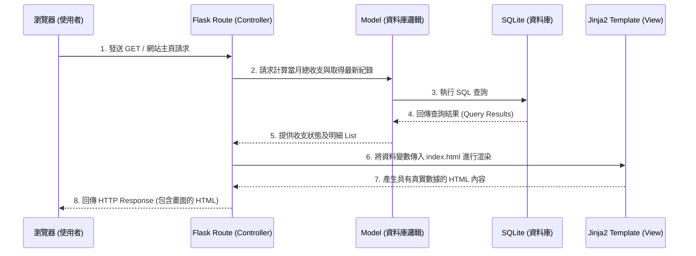

# 系統架構文件 (Architecture) - 個人記帳簿

這份文件根據 [產品需求文件 (PRD)](PRD.md) 定義了「個人記帳簿」系統的技術架構、資料夾結構與元件職責。

## 1. 技術架構說明

根據系統「快速、簡單」的需求與輕量級設計原則，本系統採用不分離前端後端的傳統伺服器渲染 (SSR) 架構：

*   **後端框架：Python + Flask**
    *   **原因**：Flask 是一套輕量且極具彈性的 Python Web 框架，非常適合用來快速開發小型專案與 MVP。此選擇讓我們能專注於核心功能的實作，而不被龐大的框架規則綁住。
*   **模板引擎：Jinja2**
    *   **原因**：與 Flask 完美整合，直接由後端渲染 HTML 頁面並回傳給瀏覽器。無需另外建置前端專案（如 React 或 Vue），減少開發複雜度並確保極快的初次載入速度。
*   **資料庫：SQLite**
    *   **原因**：作為單一檔案結構的關聯式資料庫，SQLite 不需要額外架設資料庫伺服器。對於個人記帳這類資料量小、併發存取需求單純的應用來說，是效能最好也最容易維護的選擇。可以搭配原生的 `sqlite3` 或使用 SQLAlchemy。

### Flask MVC 模式說明
雖然 Flask 本身不強制規定 MVC，但我們將依循 MVC (Model-View-Controller) 的設計模式來組織程式碼：
*   **Model (資料模型)**：負責定義資料庫結構，並處理所有與 SQLite 互動的邏輯（例如：寫入收支、計算總餘額結算）。
*   **View (視圖)**：負責呈現使用者介面。這個專案中主要是含有 Jinja2 變數標籤的 HTML / CSS / JS 檔案（位於 `templates/` 與 `static/` 資料夾）。
*   **Controller (控制器/路由)**：負責接收瀏覽器的 HTTP 請求，呼叫 Model 處理業務邏輯，並將產生的資料傳遞給 View 來渲染出最終頁面（位於 `routes/` 資料夾中）。

---

## 2. 專案資料夾結構

本專案採用的資料夾結構如下，以模組化方式將職責切分清楚：

```text
web_app_development/
├── app/                        # 應用程式主目錄
│   ├── __init__.py             # 初始化 Flask 應用，設定 Blueprint
│   ├── models/                 # [Model] 資料庫模型與操作邏輯
│   │   └── expense.py          # 負責操作收支紀錄資料
│   ├── routes/                 # [Controller] 路由與業務邏輯
│   │   ├── __init__.py
│   │   └── main_routes.py      # 收支管理相關路由（新增、列表、圖表、首頁）
│   ├── templates/              # [View] HTML 模板 (Jinja2)
│   │   ├── base.html           # 全站共用的 HTML 骨架（含導覽列）
│   │   ├── index.html          # 首頁（顯示餘額與圖表）
│   │   ├── add.html            # 新增收入或支出的表單
│   │   └── history.html        # 歷史收支列表頁面
│   └── static/                 # 靜態資源 (CSS, JS, 圖片)
│       ├── css/
│       │   └── style.css       # 全站核心樣式檔
│       └── js/
│           └── script.js       # 互動行為與圖表繪製腳本
├── instance/                   # 存放環境特定檔案（不加入版控）
│   └── database.db             # SQLite 資料庫檔案
├── docs/                       # 專案技術與需求文件
│   ├── ARCHITECTURE.md         # 系統架構設計文件（本文件）
│   └── PRD.md                  # 產品需求文件
├── app.py                      # 系統啟動入口檔案
├── requirements.txt            # Python 套件依賴清單
└── .gitignore                  # Git 忽略清單（忽略 instance 等檔案）
```

---

## 3. 元件關係圖

以下展示了系統核心處理流程中各元件的互動關係，以「使用者在首頁查看餘額與歷史紀錄」為例：



---

## 4. 關鍵設計決策

1.  **採用傳統伺服器端渲染 (SSR)**
    *   **原因**：記帳簿系統最重要是「快」。與其建立 SPA (React/Vue) API 架構來回通訊，我們選擇由後端直接生出 HTML。這省去了大量的 JavaScript 傳輸跟設定，能有更好的初次載入體驗，也非常適合開發 MVP 產品。
2.  **依功能職責拆分 Models 與 Routes (MVC 結構)**
    *   **原因**：Flask 常見做法是將所有邏輯塞在單一 `app.py` 中，但這不利於維護與擴充（如未來加入匯出報表功能）。我們在一開始就將專案拆分成 `models/` 與 `routes/` 配合 Flask Blueprint 來管理，確保程式碼具備高可讀性與擴充性。
3.  **圖表由前端整合第三方套件進行渲染 (Client-side Rendering)**
    *   **原因**：雖然頁面是由後端渲染，但圖表 (Chart) 部分，若由後端產生圖檔會增加後端伺服器負擔且不利互動。因此我們會利用庫如 Chart.js，讓 Flask 將統計完的數據以變數傳入 Jinja2，然後透過前端 JS 在 Canvas 繪製圖表，同時提供絢麗的動畫效果。
4.  **堅持簡約的原生 CSS (Vanilla CSS)**
    *   **原因**：為了實踐 PRD 中強調的最佳化「視覺體驗」與「動態回饋」，避免套用沈重的 CSS 框架包袱，選擇由自己掌控核心的樣式系統，專注在色系選用、玻璃擬態 (Glassmorphism) 及微動畫操作的設計，確保「簡單快速」的產品調性。
