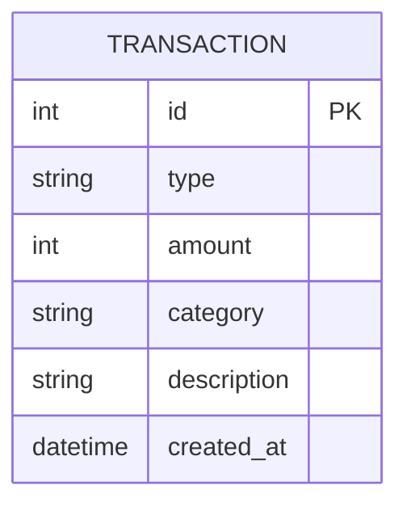

# 資料庫設計文件 (DB Design)

這份文件描述了「個人記帳簿」系統的資料表結構，並針對 SQLite 提供了完整的 Schema 定義。

## 1. ER 圖（實體關係圖）

本系統為輕量級個人記帳應用，核心資料集中於「收支紀錄 (Transaction)」。為了達成「快速、簡單」的需求，我們設計單一資料表來儲存所有的收入與支出紀錄。



## 2. 資料表詳細說明

### 2.1 `transactions` (收支紀錄表)
核心資料表，儲存所有的收支明細。

- `id` (INTEGER): Primary Key，自動遞增。
- `type` (TEXT): 紀錄類型，限制為 `'income'` (收入) 或 `'expense'` (支出)。(必填)
- `amount` (INTEGER): 交易金額，使用整數儲存。(必填)
- `category` (TEXT): 收支分類，例如「飲食」、「交通」、「薪資」。(必填)
- `description` (TEXT): 備註說明，讓使用者可以補充交易細節。(選填)
- `created_at` (DATETIME): 建立時間，預設為資料庫寫入時的當下時間 (CURRENT_TIMESTAMP)。

## 3. SQL 建表語法

請參考 `database/schema.sql`，其內容如下：

```sql
CREATE TABLE IF NOT EXISTS transactions (
    id INTEGER PRIMARY KEY AUTOINCREMENT,
    type TEXT NOT NULL CHECK(type IN ('income', 'expense')),
    amount INTEGER NOT NULL,
    category TEXT NOT NULL,
    description TEXT,
    created_at DATETIME DEFAULT CURRENT_TIMESTAMP
);
```

## 4. Python Model 程式碼

使用 Python 內建的 `sqlite3` 模組，Model 檔案位於 `app/models/expense.py`。
它包含基礎的 CRUD 方法與協助首頁圖表渲染的統整方法：
- `create()`: 新增一筆紀錄
- `get_all()`: 取得所有紀錄（依時間倒序）
- `get_by_id()`: 依據 ID 取得單筆紀錄
- `update()`: 更新紀錄
- `delete()`: 刪除紀錄
- `get_summary()`: 計算總收入、總支出與總結餘
