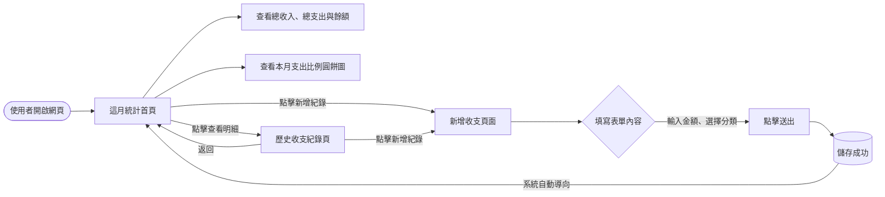
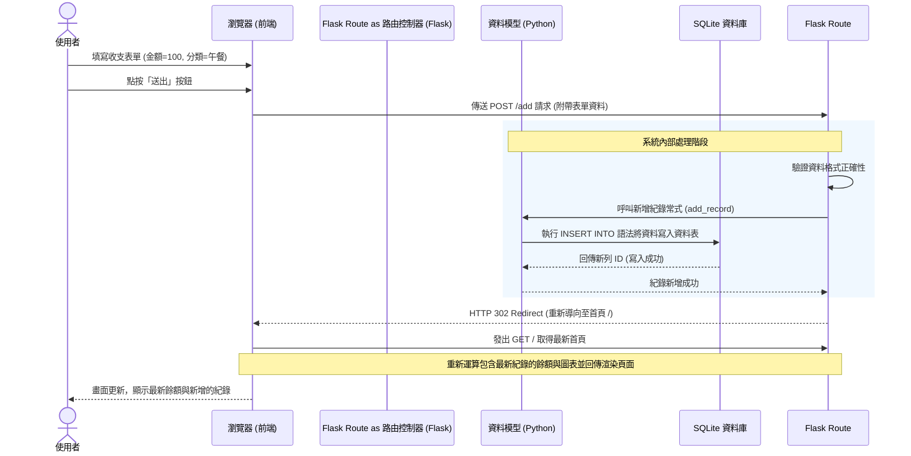

# 流程圖文件 (Flowchart) - 個人記帳簿

這份文件基於產品需求文件 (PRD) 與系統架構文件 (Architecture) 所設計的流程視覺化圖表，旨在說明使用者的操作路徑與系統內部的資料互動過程。

## 1. 使用者流程圖 (User Flow)

此圖描述使用者從進入記帳系統開始的完整操作路徑，包含瀏覽與新增資料等核心動作。

## 2. 系統序列圖 (System Flow - 新增紀錄)

此圖描述使用者執行「新增一筆收支紀錄」時，系統前後端及資料庫之間完整的互動過程。

## 3. 功能清單與路由對照表

本表統整了上述流程圖中所對應到的基礎軟體功能、與其在 Flask 開發時將設定之路由 (Route)。

| 功能名稱 | 介面說明 | 對應 URL 路徑 | HTTP 方法 |
| :--- | :--- | :--- | :--- |
| **首頁與餘額概況** | 顯示當月總收入、總支出、結餘數字與支出圓餅圖 | `/` | `GET` |
| **新增紀錄介面** | 提供下拉選單選擇分類，輸入金額與備註的表單 | `/add` | `GET` |
| **送出新增紀錄** | 接收表單傳遞過來的資料並寫入資料庫 | `/add` | `POST` |
| **歷史紀錄列表** | 提供表格狀的收支歷史明細（依時間倒序） | `/history` | `GET` |

> 註：這些路由對應的是 MVP 核心階段所必須實作的功能範圍。未來如擴充編輯、刪除或匯出 CSV 功能，將在此表後續擴展對應的 `/edit/<id>`, `/delete/<id>`, 與 `/export` 路由。
